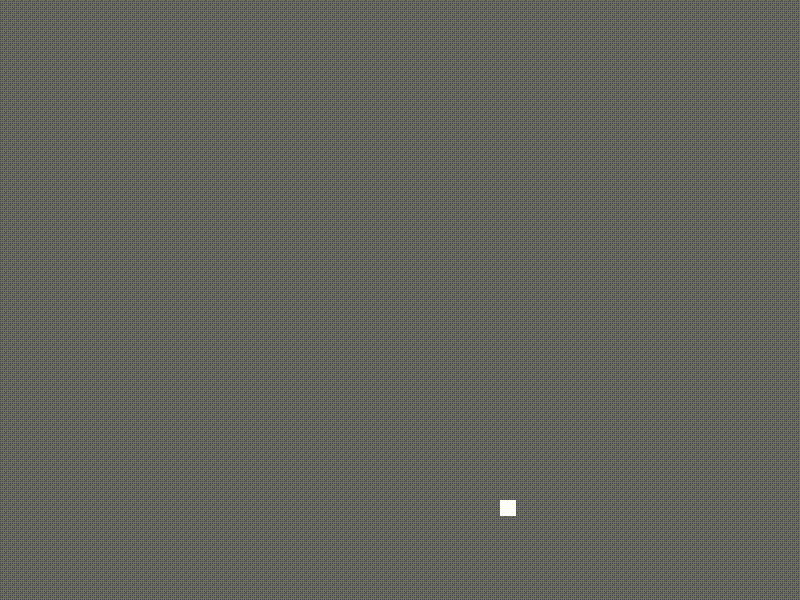

# Möan.lua
A simple messagebox system for LÖVE 0.10.x.

```lua
Moan.speak("Title", {"Hello world!", "It's me;--Möan.lua!"})
```

Further documentation can be found at: http://ttxi.github.io/Moan.lua/



## Features
- Multiple choices prompt
- Typing effect + sounds
- Pauses
- UTF-8 support
- Optional HUMP camera integration
- Message box icons
- Autowrapped text

### To do:
- Add simple theming interface
- Improves Auto-wrap algo. to calculate string length (in px) based on character width
- Rich text, i.e. coloured/bold/italic text
- Possibly go towards a more OO approach

## How to
* Download the `Moan.lua` file in this repo
* Include it via adding, `Moan = require('Moan')`, to the top of your `main.lua`
* Add the following to your main.lua

```lua
Moan = require('Moan')

function love.load()
  Moan.speak("Title", {"Hello World!"})
end

function love.update(dt)
    Moan.update(dt)
end

function love.draw()
    -- Draw your stuff here

    -- We want the messagebox to be ontop of all other elements, so we draw it last
    -- Alternatively use a z-orderer (https://love2d.org/wiki/Tutorial:Drawing_Order)
    Moan.draw()
end

function love.keyreleased(key)
    Moan.keyreleased(key) -- or Moan.keypressed(key)
end
```
Old documentation can be found at: https://github.com/twentytwoo/Moan.lua/blob/5ecbd7eb81cdfe181f772242c5fda2292e363933/README.md
